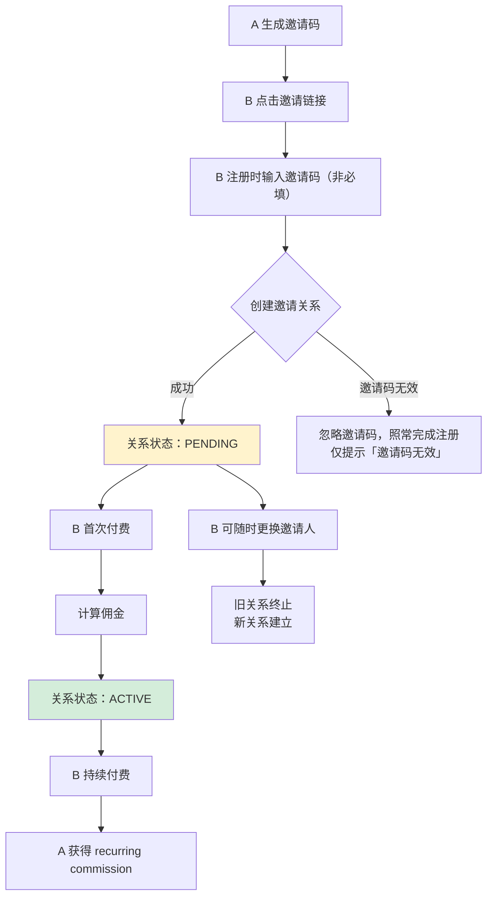
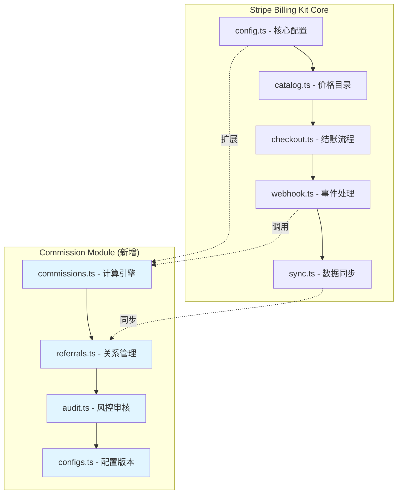
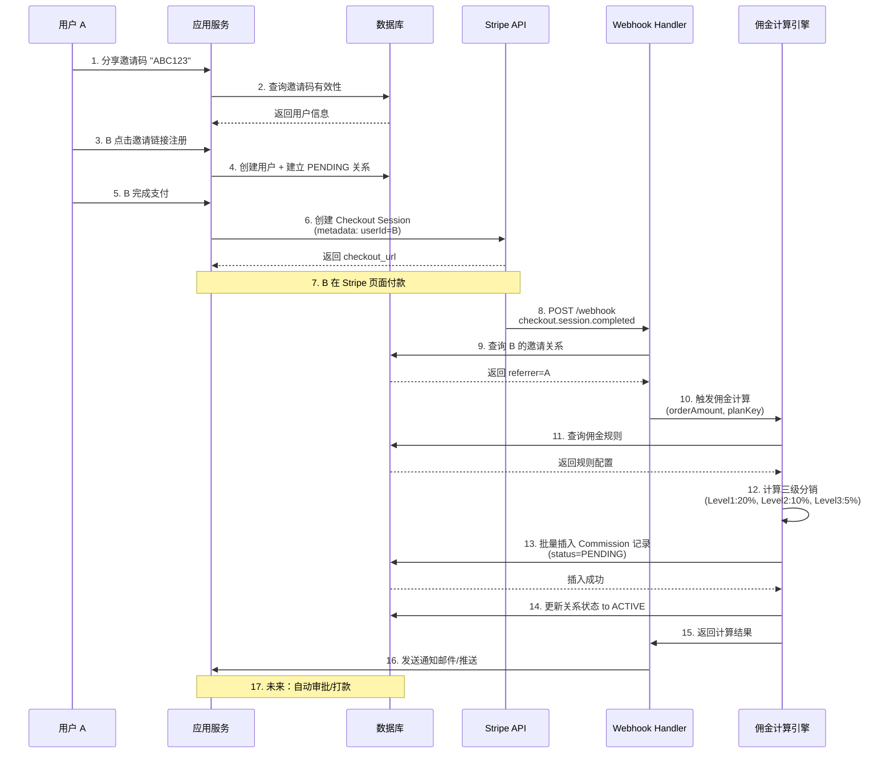

# Stripe Billing Kit - 佣金系统开发规范

**版本**: 1.3.0  
**最后更新**: 2026-07-27  
**状态**: MVP 需求定稿

---

## 📋 目录

1. [项目概述](#1-项目概述)
2. [核心业务逻辑](#2-核心业务逻辑)
3. [功能范围定义](#3-功能范围定义)
4. [数据模型设计](#4-数据模型设计)
5. [技术架构](#5-技术架构)
6. [API 设计规范](#6-api-设计规范)
7. [安全与风控](#7-安全与风控)
8. [配置系统设计](#8-配置系统设计)
9. [实施路线图](#9-实施路线图)

---

## 1. 项目概述

### 1.1 产品定位

Stripe Billing Kit 是一个**模块化的佣金系统组件**，专为基于 Stripe 的 SaaS 开发者设计。它提供开箱即用的邀请推广和佣金结算能力，让开发者能够在 minutes 内搭建自己的 affiliate/referral program。

**核心价值主张**：
- ✅ **零侵入集成**：复用现有的 Stripe Billing Kit 架构，只需扩展 storage adapter 和 hooks
- ✅ **端到端 Stripe 流程**：从邀请追踪 → 支付分账 → 佣金结算全链路通过 Stripe
- ✅ **灵活的奖励配置**：支持现金/产品两种奖励类型，可针对不同套餐自定义比例
- ✅ **企业级反欺诈**：三层审核机制 + 智能风险评估
- ✅ **多租户友好**：配置版本控制、A/B 测试支持

### 1.2 设计原则

```typescript
// Principle 1: 邀请码优先于优惠码
// 我们只处理「身份关联」，不处理「价格歧视」

interface ReferralCodeVsCoupon {
  referralCode: "JOHN-REF";   // 个人专属标识，用于归属追踪
  purpose: "attribution";      // 目的：建立 A→B 的关系
  uniqueness: "一人一码";      // 不可共享
  
  // 与 Coupon 的区别
  differenceFromCoupon: {
    coupon: "SUMMER20",         // 公开促销代码
    target: "打折促销";          // 目的：价格歧视工具
    shareability: "多人可用";    // 可广泛传播
  }
}

// Principle 2: 账号级绑定优于订单级绑定
// 一次注册终身有效，无需重复输入

// Principle 3: 开发者自主决策手续费承担方式
// 不提供默认策略，由生产者自行配置

// Principle 4: 只做 MVP 核心功能，避免过度设计
// 不实现排行榜、优惠券系统等低价值特性
```

---

## 2. 核心业务逻辑

### 2.1 邀请关系生命周期



### 2.2 关键业务流程

#### Flow 1: 新用户注册（账号级绑定）

```typescript
// Step 1: 分享链接
const inviteLink = generateInviteLink({
  userId: "user_A",
  code: "ABC123",
  expiresIn: null  // 永久有效
});
// https://yoursite.com/signup?ref=ABC123

// Step 2: Landing page 自动填充（可选展示给用户）
<SignupForm
  defaultValues={{
    email: "",
    password: "",
    referralCode: "ABC123"  // 来自 URL 参数，预填但非必填
  }}
/>

// Step 3: 提交注册（邀请码为非必填字段）
POST /api/auth/signup
{
  "email": "b@example.com",
  "password": "hashed_pwd",
  "referralCode": "ABC123"  // ← optional, can be empty
}

// Step 4: 事务性创建关系（数据库层保证一致性）
await db.$transaction(async (tx) => {
  // 4a. 创建用户
  const newUser = await tx.user.create({
    data: {
      email: "b@example.com",
      passwordHash: hashedPassword,
      meta: {}  // 预留字段用于首次来源记录
    }
  });
  
  // 4b. 验证邀请码并建立关系（如果提供了）
  // ⚠️ 铁律：邀请码非必填，且无效邀请码【绝不能】阻断注册流程。
  //    无效/自推自/已停用的码 → 静默跳过关系创建，仅在响应中附带提示文案。
  if (input.referralCode) {
    const referrer = await tx.referralCode.findUnique({
      where: { code: input.referralCode },
      include: { user: true }
    });
    
    if (referrer && referrer.isActive && referrer.userId !== newUser.id) {
      // 防止自推自
      await tx.referralRelationship.create({
        data: {
          referrerId: referrer.userId,
          refereeUserId: newUser.id,
          originalCode: input.referralCode,
          status: "PENDING",  // 等待第一次付费激活
          createdAt: new Date(),
          metadata: {
            source: "SIGNUP_FORM",
            registeredAt: new Date().toISOString()
          }
        }
      });
      
      // 同时记录用户的唯一邀请码（双向绑定）
      await tx.referralCode.create({
        data: {
          code: generateUniqueReferralCode(newUser.id),
          userId: newUser.id,
          isActive: true,
          createdAt: new Date()
        }
      });
    }
  } else {
    // 无邀请码情况：仍需创建用户自己的邀请码
    await tx.referralCode.create({
      data: {
        code: generateUniqueReferralCode(newUser.id),
        userId: newUser.id,
        isActive: true,
        createdAt: new Date()
      }
    });
  }
});

// Step 5: 前端反馈
return {
  success: true,
  message: "✅ 注册成功！",
  showReferralBanner: !!newUser.firstReferralCode,
  bannerMessage: "你已通过 ABC123 加入，邀请好友解锁奖励"
};
```

#### Flow 2: 付费触发佣金计算

```typescript
// Webhook handler (checkout.session.completed)
async function handleCheckoutCompleted(
  ctx: BillingContext, 
  event: Stripe.CheckoutSessionCompletedEvent
): Promise<void> {
  const session = event.data.object;
  
  // 归因优先级链（fallback，参考 Refgrow 实践）：
  //   1. 账号级绑定关系表（主要且唯一权威来源 —— 账号级绑定的核心优势）
  //   2. session.metadata.userId（Checkout 创建时注入）
  //   3. session.client_reference_id
  //   4. customer email 回溯匹配（兜底，需开启配置项）
  // 注意：2~4 仅用于解析「付费者是谁」，佣金归属始终以关系表为准
  const userId = session.metadata?.userId || session.client_reference_id;
  
  if (!userId) return;
  
  // 1. 查询该用户的邀请关系
  const relationship = await getActiveReferralRelationship(ctx, userId);
  
  if (!relationship) {
    ctx.logger.info('no_referral_relationship', { userId });
    return;  // 没有推荐人，跳过佣金计算
  }
  
  // 2. 获取订单详情
  const orderAmount = session.amount_total ?? 0;  // in cents
  const currency = session.currency ?? 'usd';
  const planKey = session.metadata?.planKey;
  
  // 3. 查询佣金规则（按套餐 + 层级）
  const rules = await getCommissionRulesByPlan(ctx, planKey);
  
  // 4. 计算多级分销佣金
  const commissions = await calculateMultiTierCommissions({
    baseAmount: orderAmount,
    currency,
    rules,
    referralChain: await buildReferralChain(relationship.referrerId),  // Level 1, 2, 3...
    stripeFeeRate: 0.029,  // 动态配置
    stripeFixedFee: 30     // 动态配置
  });
  
  // 5. 批量插入佣金记录
  await db.commission.createMany({
    data: commissions.map(c => ({
      referrerUserId: c.referrerId,
      orderId: session.id,
      planKey,
      amount: c.amount,
      currency: c.currency,
      tierLevel: c.tierLevel,
      status: 'PENDING',  // 进入审核队列
      validUntil: addDays(new Date(), config.holdPeriodDays),
      createdAt: new Date()
    }))
  });
  
  // 6. 更新关系状态为 ACTIVE
  await db.referralRelationship.update({
    where: { id: relationship.id },
    data: { status: 'ACTIVE' }
  });
  
  // 7. 通知推荐人
  await notifyReferrerOfCommission({
    userId: relationship.referrerId,
    commissionAmount: commissions.reduce((sum, c) => sum + c.amount, 0),
    orderId: session.id
  });
}
```

#### Flow 3: 更换邀请人

```typescript
// 用户在个人中心主动更换推荐人
POST /api/referral/change-referrer
{
  "newReferralCode": "XYZ789"
}

// 后端处理
async function changeReferrer(userId: string, newCode: string) {
  // 1. 验证新邀请码有效性
  const newReferrer = await findActiveReferrerCode(newCode);
  if (!newReferrer) {
    throw new Error("无效的邀请码");
  }
  
  // 2. 获取当前活跃关系（如果有）
  const currentRelationship = await getCurrentActiveRelationship(userId);
  
  // 3. 事务性操作
  await db.$transaction(async (tx) => {
    // 3a. 终止旧关系（标记为 expired）
    if (currentRelationship) {
      await tx.referralRelationship.update({
        where: { id: currentRelationship.id },
        data: {
          status: 'EXPIRED',
          endedAt: new Date(),
          endReason: 'USER_REQUESTED_CHANGE'
        }
      });
      
      // 3b. 可选：结算未支付的佣金
      if (config.autoSettleOnChange) {
        await settlePendingCommissions(currentRelationship.referrerUserId);
      }
    }
    
    // 3c. 创建新关系（重置为 PENDING）
    await tx.referralRelationship.create({
      data: {
        referrerUserId: newReferrer.userId,
        refereeUserId: userId,
        originalCode: newCode,
        status: 'PENDING',
        createdAt: new Date()
      }
    });
  });
  
  return { success: true, message: "✅ 推荐人已更换" };
}
```

### 2.3 奖励组件模型（RewardComponent）

> 设计决策：**不做经营模态预设**，所有返佣形态由生产者用组件自行组合。泛用性 = 包含不局限——新玩法应该是"组合出来的"，不是"开发出来的"。

#### 2.3.1 模型定义

**一条佣金规则 = 触发场景（TriggerScope） × 1~N 个奖励组件（RewardComponent）**

```typescript
interface RewardComponent {
  // 组件类型（三选一）
  componentType: 'CASH_PERCENT' | 'CASH_FIXED' | 'PRODUCT';
  //              比例金钱        固定金额       产品（额度包/VIP/时长等）

  // 取值模式（二选一）
  valueMode: 'FIXED' | 'DYNAMIC';

  // FIXED 模式
  fixedValue?: number;      // CASH_PERCENT: 0.20（20%）| CASH_FIXED: cents | PRODUCT: 发放数量
  productRef?: string;      // PRODUCT 组件必填：生产者系统内的产品标识（对本模块是黑盒字符串）

  // DYNAMIC 模式：阶梯表（按驱动变量分档）
  dynamicConfig?: {
    driverVariable: DriverVariable;
    ladder: Array<{
      from: number;         // 档位下限（含）
      to: number | null;    // 档位上限（不含），null = 无上限
      value: number;        // 该档取值（含义同 fixedValue）
    }>;
  };

  // 安全约束
  minCommissionableAmountCents?: number;  // 订单低于此金额时本组件不触发（防穿仓）
  maxValueCents?: number;                 // 单笔封顶
}

// 驱动变量严格收口：MVP 仅开放 3 个，每新增一个必须过安全评审
type DriverVariable =
  | 'ORDER_AMOUNT'                    // 订单/账单金额 → 高价值比例（$1000 以上跳高档）
  | 'REFERRER_MONTHLY_CONVERSIONS'    // 推荐人月转化数 → 业绩阶梯
  | 'PERIOD_INDEX';                   // 账期序号 → 生命周期衰减（前 12 期 20%，之后 10%）
```

#### 2.3.2 触发场景：与 core 九种计费模式的映射

core 的 `PlanType` 共 9 种，归一到 4 类结算触发，佣金规则按触发场景挂载：

| TriggerScope | 对应 Stripe 事件 | 结算基数 | 覆盖的 PlanType |
|-------------|----------------|---------|----------------|
| `FIRST_PAYMENT` | `checkout.session.completed` | 首笔订单金额 | `subscription`（首付）、`one_time`、`credit_package`、`credit_variable`、`daily` |
| `RECURRING_PAYMENT` | `invoice.paid`（续期账单） | 每期账单金额 | `subscription`（续费）、`trial_then_subscribe`（转正后每期） |
| `USAGE_INVOICE` | `invoice.paid`（metered 汇总账单） | **每期账单金额**（用多少、按多少计佣） | `metered` |
| `NO_PAYMENT`（不计佣） | — | 无付款不触发 | `trial_no_convert`、`first_trial`（试用期内） |

> 按量付费的"按每期金额结算"天然复用现有 `invoice.paid` webhook 管线，零额外开发。

**本质抽象**：钱进来的"形状"只有三种——单笔一次收（一次性购买）、周期收固定金额（连续性订阅）、周期收浮动金额（按量付费）。任何未来新增的 PlanType 都必然落入这三格，佣金模型无需变更（"不付钱"不是消费模式，试用类转正后即落回订阅）。

**周期收的两条边界处理原则**：

1. **升降级分摊账单（proration）**：月中升降级产生的补差价账单（可能金额极小、为零或含负数 credit 行）归属 `RECURRING_PAYMENT`，引擎一律按账单**实付金额（`invoice.amount_paid`）**计佣，配合组件的 `minCommissionableAmountCents` 自然消化零元/小额账单。
2. **混合账单**（同一订阅挂固定费 + 按量费）：按**整张账单实付金额**计佣，触发场景以该 plan 的 `PlanType` 归类为准，**不做行级拆分**——拆分精度的收益远小于其复杂度。

#### 2.3.3 形态映射表：常见需求 → 组件组合

| 返佣形态 | 组件表达 |
|---------|---------|
| 固定返佣比例 | `CASH_PERCENT + FIXED` |
| 动态返佣比例 | `CASH_PERCENT + DYNAMIC` |
| 固定返佣金额 | `CASH_FIXED + FIXED` |
| 动态返佣金额 | `CASH_FIXED + DYNAMIC` |
| 固定返佣产品 | `PRODUCT + FIXED` |
| 动态返佣产品（转化越多送越多） | `PRODUCT + DYNAMIC` |
| 固定金钱 + 固定产品 | `[CASH_FIXED, PRODUCT]` 两组件叠加 |
| 比例金钱 + 固定产品 | `[CASH_PERCENT, PRODUCT]` |
| 高价值比例 | `CASH_PERCENT + DYNAMIC`（driver = ORDER_AMOUNT） |
| 业绩阶梯 | `CASH_PERCENT + DYNAMIC`（driver = REFERRER_MONTHLY_CONVERSIONS） |
| 生命周期衰减 | `CASH_PERCENT + DYNAMIC`（driver = PERIOD_INDEX） |

#### 2.3.4 产品奖励发放解耦

额度包、VIP 会员是生产者自己系统里的概念，本模块**只记账、不发放**：

```typescript
// 佣金审核通过后，PRODUCT 组件触发标准化 hook
hooks: {
  onProductRewardGrant: async ({ referrerUserId, productRef, quantity, commissionId }) => {
    // 由开发者实现实际发放（加额度/延长会员等）
    await myCredits.grant(referrerUserId, productRef, quantity);
    return { granted: true };   // 返回结果写回 Commission 记录，状态可追踪
  }
}
```

发放失败会保留 `GRANT_FAILED` 状态并进入重试/告警，但发放逻辑本身永远在开发者侧——与优惠券划界逻辑一致。

#### 2.3.5 多级推荐链构建规则

多级分销（最多 3 级）的链构建必须遵守以下规则：

```
付费者 B 付款 → 沿 ACTIVE 关系向上回溯：
  L1 = B 的推荐人 A（直接邀请）
  L2 = A 的推荐人（间接）
  L3 = A 的推荐人的推荐人（团队奖）
```

1. **链深硬上限 3 级**：回溯到第 3 级或断链（某人无推荐人）即停止；
2. **防环**：回溯时携带已访问用户集合，一旦出现环（A→B→C→A）立即截断、记录告警并标记相关账户进入人工审核（环 = 强作弊信号）；
3. **链快照固化**：计佣那一刻把整条链固化写入各级 Commission 记录（`rateBreakdown` 内含 chain 快照）。之后任何人更换推荐人**只影响未来订单**，历史佣金归属永不改写；
4. **逐级独立匹配规则**：每级按 `(planKey, triggerScope, tierLevel)` 独立匹配 CommissionRule，某级无匹配规则则该级不计佣、**不递补**（L2 无规则时 L2 的份额不会顺延给 L3）；
5. **中断即止**：链上某人的关系状态为 TERMINATED（违规封禁）时，该级及更上级均不计佣。

---

## 3. 功能范围定义

### 3.1 MVP 必选功能（Phase 1）

| 功能模块 | 包含内容 | 优先级 |
|---------|---------|--------|
| **邀请码管理** | • 自动生成唯一邀请码<br>• 邀请码 CRUD 操作<br>• 邀请码状态管理（active/inactive） | P0 |
| **账号级绑定** | • 注册时通过邀请码关联<br>• 永久有效（可手动更换）<br>• 状态机：PENDING → ACTIVE → EXPIRED | P0 |
| **佣金计算引擎** | • 组件化奖励模型（RewardComponent 自由组合，见 2.3）<br>• 动态阶梯（3 个驱动变量）+ 固定值双模式<br>• 多级分销支持（最多 3 级）<br>• Stripe 手续费扣除逻辑（三种模式） | P0 |
| **支付分账** | • Stripe Checkout metadata 传递<br>• Webhook 事件监听<br>• 佣金记录持久化 | P0 |
| **审核流程** | • 自动化规则（IP 黑名单、邮箱白名单）<br>• 人工审核队列<br>• 高风险预警 | P1 |
| **配置版本控制** | • 配置快照保存<br>• 版本切换/回滚<br>• 变更记录审计 | P1 |
| **数据统计** | • 邀请人数统计<br>• 佣金总额/待结算/已发放<br>• 转化率漏斗分析 | P2 |

### 3.2 Phase 2 高级功能

| 功能模块 | 说明 |
|---------|------|
| Stripe Connect 打款 | 自动化 payout 到推荐人银行账户 |
| KYC/税务合规 | 1099-K 表格收集 |
| 多级营销报表 | 团队业绩树状图 |

### 3.3 明确排除的功能（Not In Scope）

❌ **API 访问配置权限（程序化配置 API）**  
> **明确不做**（风险高、性价比低）。佣金比例、结算规则等敏感配置只能通过管理后台 Wizard 修改，不开放任何程序化配置 API。原因：一旦 API key 泄露，攻击者可将佣金率改为 100% 后批量刷单，损失不可逆；而 MVP 阶段几乎没有第三方系统集成的真实需求。

❌ **兑换码/优惠码系统**  
> 这是独立的功能，需要单独开发折扣逻辑、库存管理等。本模块只负责「谁邀请了谁」，不负责「给多少钱折扣」。开发者可以自行在 Stripe 中配置 promotion codes 并与我们的 referral system 并行使用。

❌ **排行榜/竞赛系统**  
> 容易引发作弊战，增加维护成本。MVP 阶段专注基础的邀请返利，不做 gamification。

❌ **社交分享集成**  
> WhatsApp/WeChat/Facebook一键分享等功能交由开发者自行集成。我们仅提供邀请码生成接口。

❌ **邮件营销自动化**  
> 欢迎邮件、提醒邮件等属于营销工具范畴，不在计费系统边界内。

---

## 4. 数据模型设计

### 4.1 Prisma Schema

```prisma
// 文件路径：templates/schema/billing.prisma

// ──────────────────────────────────────────────────────
// 核心表：邀请码
// ──────────────────────────────────────────────────────
model ReferralCode {
  id          String   @id @default(uuid())
  code        String   @unique  // "ABC123" - 简短易记
  userId      String   @unique  // 唯一绑定一个用户
  isActive    Boolean  @default(true)
  
  // 统计
  totalInvites    Int    @default(0)
  convertedCount  Int    @default(0)
  
  // 审计
  createdAt     DateTime @default(now())
  updatedAt     DateTime @updatedAt
  
  // 关系
  user          User     @relation(fields: [userId], references: [id])
  usedBy        ReferralRelationship[]  // 作为被邀请人使用的码
  
  @@index([userId])
  @@index([isActive])
}

// ──────────────────────────────────────────────────────
// 核心表：邀请关系
// ──────────────────────────────────────────────────────
model ReferralRelationship {
  id                String      @id @default(uuid())
  
  // 关联关系
  referrerUserId    String      // 推荐人 ID
  refereeUserId     String      // 被推荐人 ID
  
  // 邀请码来源
  originalCode      String      // 最初使用的邀请码
  assignedCode      String?     // 系统自动分配的备用码
  
  // 状态管理
  status            RelationshipStatus @default(PENDING)
  createdAt         DateTime    @default(now())
  activatedAt       DateTime?   // 被推荐人首次付费后激活
  expiredAt         DateTime?
  
  // 元数据
  metadata          Json?       // { source: "SIGNUP_FORM", ip: "...", userAgent: "..." }
  
  // 限制（防刷单）
  maxReferrals      Int?        // 每人最多邀请多少人（全局配置可覆盖）
  invitedCount      Int         @default(0)
  
  // 关系索引
  @@unique([referrerUserId, refereeUserId])  // 同一对不能重复建立
  @@index([referrerUserId])
  @@index([refereeUserId])
  @@index([status])
  
  // 关系映射
  referrer          User        @relation("ReferredUsers", fields: [referrerUserId], references: [id])
  referee           User        @relation("ReferredUsers", fields: [refereeUserId], references: [id])
  usedBy            User        @relation("UsedCodes", fields: [originalCode], references: [code], map: "referral_relationship_code")
}

enum RelationshipStatus {
  PENDING    // 注册完成，等待首次付费
  ACTIVE     // 已付费，开始计佣
  EXPIRED    // 被替换或过期
  TERMINATED // 违规被封禁
}

// ──────────────────────────────────────────────────────
// 核心表：佣金记录
// ──────────────────────────────────────────────────────
model Commission {
  id                String      @id @default(uuid())
  
  // 归属信息
  referrerUserId    String      // 拿到佣金的人
  orderId           String      // 关联的订单 ID（Stripe Session ID）
  planKey           String      // 对应哪个套餐
  
  // 金额信息
  amount            Int         // 现金佣金合计（cents，各 CASH_* 组件之和）
  currency          String      // USD/EUR/CNY
  
  // 组件计算明细快照（审计回溯：命中哪条规则、哪些组件、各算出多少）
  // [{ componentType, valueMode, driverVariable?, hitLadderStep?, computedValue }]
  rateBreakdown     Json?
  
  // 产品组件发放状态（onProductRewardGrant hook 回写）
  grantStatus       GrantStatus?
  
  // 多级分销
  tierLevel         Int         @default(1)  // Level 1/2/3
  
  // 状态管理
  status            CommissionStatus @default(PENDING)
  approvedAt        DateTime?
  paidAt            DateTime?
  validUntil        DateTime    // 有效期（防退款期）
  
  // 审核信息
  reviewStatus      ReviewStatus @default(AUTO_APPROVED)
  reviewedBy        String?     // 人工审核人 ID
  reviewedAt        DateTime?
  rejectionReason   String?
  
  // 审计
  createdAt         DateTime    @default(now())
  updatedAt         DateTime    @updatedAt
  
  // 索引
  @@unique([orderId, referrerUserId, tierLevel])  // 幂等键：同一订单同一人同一层级只计一次佣
  @@index([referrerUserId])
  @@index([orderId])
  @@index([status])
  @@index([validUntil])
}

enum CommissionStatus {
  PENDING     // 待审核
  APPROVED    // 审核通过，可提现
  PAID        // 已打款
  REFUNDED    // 退款追回
  REJECTED    // 审核拒绝
  EXPIRED     // 过期作废
}

enum ReviewStatus {
  AUTO_APPROVED   // 自动通过（低风险）
  MANUAL_REVIEW   // 需要人工审核
  FLAGGED         // AI 标记可疑
  REJECTED        // 已拒绝
}

enum GrantStatus {
  NOT_APPLICABLE  // 规则无 PRODUCT 组件
  PENDING_GRANT   // 待发放（审核通过后触发 hook）
  GRANTED         // 开发者 hook 确认发放成功
  GRANT_FAILED    // 发放失败，进入重试/告警
}

// ──────────────────────────────────────────────────────
// 核心表：佣金规则配置（组件化模型，见 2.3 节）
// ──────────────────────────────────────────────────────
model CommissionRule {
  id                String      @id @default(uuid())
  programId         String      // 所属的佣金计划 ID
  
  // 适用范围
  planKey           String?     // null = 全局适用，否则指定套餐
  triggerScope      TriggerScope @default(FIRST_PAYMENT)  // 结算触发场景（见 2.3.2）
  tierLevel         Int?        // null = 适用于所有层级，否则指定层级
  
  // 奖励组件：1~N 个 RewardComponent 自由组合（结构见 2.3.1）
  // [{ componentType: 'CASH_PERCENT', valueMode: 'DYNAMIC', dynamicConfig: {...} },
  //  { componentType: 'PRODUCT', valueMode: 'FIXED', fixedValue: 1, productRef: 'vip_month' }]
  components        Json
  
  // 现金计佣基数与手续费承担（作用于规则内所有 CASH_* 组件）
  commissionBase          CommissionBase          @default(NET_BASED)
  platformFeeHandlingMode PlatformFeeHandlingMode @default(CONSUMED_BY_PLATFORM)
  holdPeriodDays          Int                     @default(30)  // 冻结期天数
  
  // 审核规则
  autoApproveUnder  Int?                    // <$xxx 自动通过
  requireReviewOver Int?                    // >$xxx 必须人工审核
  
  // 风控参数
  cooldownHours     Int      @default(24)  // 两次佣金间隔最小时间
  maxPerDay         Int?                    // 单日最高佣金笔数
  
  // 状态
  isActive          Boolean  @default(true)
  priority          Int      @default(0)     // 优先级，数字越高越先匹配
  
  // 审计
  createdAt         DateTime @default(now())
  updatedAt         DateTime @updatedAt
  
  // 索引
  @@unique([programId, planKey, triggerScope, tierLevel])
  @@index([programId])
}

enum TriggerScope {
  FIRST_PAYMENT       // 首笔付款（订阅首付/一次性/额度包/日付）
  RECURRING_PAYMENT   // 订阅续期账单
  USAGE_INVOICE       // 按量付费每期汇总账单
}

enum CommissionBase {
  NET_BASED    // 扣除 Stripe 手续费后计佣
  GROSS_BASED  // 按订单毛额计佣
}

enum PlatformFeeHandlingMode {
  CONSUMED_BY_PLATFORM   // 平台承担手续费（基于净收入计算佣金）
  PASSED_TO_CUSTOMER     // 转嫁给客户（结账时加收手续费）
  SHARED                 // 协商分担（调整佣金率部分抵消）
}

// ──────────────────────────────────────────────────────
// 核心表：配置版本快照
// ──────────────────────────────────────────────────────
model CommissionConfigurationVersion {
  id            String   @id @default(uuid())
  programId     String
  versionNumber Int      @unique
  
  // 完整配置快照（JSON 结构）
  snapshot      Json
  
  // 变更说明
  notes         String?
  createdBy     String? // 管理员 ID
  createdAt     DateTime @default(now())
  activatedAt   DateTime?
  isLatest      Boolean  @default(false)
  
  // 索引
  @@index([programId])
  @@index([versionNumber])
}

// ──────────────────────────────────────────────────────
// 辅助表：审核队列
// ──────────────────────────────────────────────────────
model AuditQueueItem {
  id                String      @id @default(uuid())
  
  // 关联对象
  commissionId      String      @unique
  reason            ReviewTrigger  // 为什么需要审核
  
  // 风险评分
  riskScore         Int         @default(0)  // 0-100
  riskFactors       Json?        // ["same_ip", "high_amount", "temp_email"]
  
  // 状态
  status            QueueStatus  @default(PENDING)
  assignedTo        String?      // 分配给哪个审核员
  reviewedAt        DateTime?
  reviewNotes       String?
  
  createdAt         DateTime    @default(now())
  updatedAt         DateTime    @updatedAt
  
  @@index([status])
  @@index([riskScore])
  @@index([createdAt])
}

enum ReviewTrigger {
  HIGH_AMOUNT          // 超过阈值
  RAPID_GROWTH         // 快速增长异常
  SAME_DEVICE          // 同设备检测
  SUSPICIOUS_PATTERN   // 异常行为模式
  MANUAL_FLAG          // 人工标记
  PERIODIC_AUDIT       // 周期性审查
}

enum QueueStatus {
  PENDING     // 待处理
  IN_PROGRESS // 审核中
  APPROVED    // 已通过
  REJECTED    // 已拒绝
  ESCALATED   // 升级处理
}

// ──────────────────────────────────────────────────────
// 核心表：打款记录（付佣腿唯一事实来源，与 Stripe/PayPal 双向对账）
// ──────────────────────────────────────────────────────
model Payout {
  id                    String        @id @default(uuid())
  
  // 归属
  referrerUserId        String        // 收款人
  commissionIds         Json          // 本次打款覆盖的佣金 ID 列表（批量结算）
  
  // 金额
  amount                Int           // cents（各佣金之和）
  currency              String
  feeAmount             Int           @default(0)  // 通道手续费（如 PayPal $0.25/笔）
  
  // 通道信息
  provider              PayoutProviderName   // STRIPE_CONNECT / PAYPAL / MANUAL
  providerTransactionId String?       // 通道侧流水号（对账主键）
  providerPayload       Json?         // 通道原始响应快照
  idempotencyKey        String        @unique  // = payout.id，防重复打款
  
  // 状态机：CREATED → PROCESSING → SUCCEEDED / FAILED / UNCLAIMED → RETURNED
  status                PayoutStatus  @default(CREATED)
  failureReason         String?
  
  // 审计
  createdAt             DateTime      @default(now())
  processedAt           DateTime?
  settledAt             DateTime?
  
  @@index([referrerUserId])
  @@index([status])
  @@index([provider, providerTransactionId])
}

enum PayoutProviderName {
  STRIPE_CONNECT
  PAYPAL
  MANUAL          // 线下打款，人工标记
}

enum PayoutStatus {
  CREATED       // 已创建，待提交通道
  PROCESSING    // 通道处理中（PayPal 异步）
  SUCCEEDED     // 打款成功
  FAILED        // 通道失败，佣金回滚为 APPROVED 可重试
  UNCLAIMED     // PayPal 收款邮箱未认领
  RETURNED      // UNCLAIMED 超期退回，佣金回滚为 APPROVED
}

// ──────────────────────────────────────────────────────
// 辅助表：Outbox 异步任务（webhook 快速响应，见 5.4.2）
// ──────────────────────────────────────────────────────
model CommissionJob {
  id          String    @id @default(uuid())
  eventId     String    @unique   // Stripe event.id，与 claimEvent 联动
  jobType     String    // CALC_COMMISSION / CLAWBACK / GRANT_PRODUCT / PAYOUT
  payload     Json
  status      String    @default("PENDING")  // PENDING / RUNNING / DONE / DEAD
  attempts    Int       @default(0)
  nextRunAt   DateTime  @default(now())      // 指数退避重试
  createdAt   DateTime  @default(now())
  
  @@index([status, nextRunAt])
}

// ──────────────────────────────────────────────────────
// 用户表扩展（假设已有 User 表）
// ──────────────────────────────────────────────────────
// 注意：不在本模块新增字段，而是通过 join 表关联
```

### 4.2 数据库迁移脚本示例

```sql
-- 文件路径：templates/migrations/001_add_referral_tables.sql

CREATE TYPE relationship_status AS ENUM ('PENDING', 'ACTIVE', 'EXPIRED', 'TERMINATED');
CREATE TYPE commission_status AS ENUM ('PENDING', 'APPROVED', 'PAID', 'REFUNDED', 'REJECTED', 'EXPIRED');
CREATE TYPE review_status AS ENUM ('AUTO_APPROVED', 'MANUAL_REVIEW', 'FLAGGED', 'REJECTED');

-- 1. 邀请码表
CREATE TABLE referral_codes (
    id UUID PRIMARY KEY DEFAULT gen_random_uuid(),
    code VARCHAR(50) NOT NULL UNIQUE,
    user_id UUID NOT NULL UNIQUE,
    is_active BOOLEAN DEFAULT true,
    total_invites INTEGER DEFAULT 0,
    converted_count INTEGER DEFAULT 0,
    created_at TIMESTAMPTZ DEFAULT NOW(),
    updated_at TIMESTAMPTZ DEFAULT NOW()
);

CREATE INDEX idx_referral_codes_user_id ON referral_codes(user_id);
CREATE INDEX idx_referral_codes_active ON referral_codes(is_active);

-- 2. 邀请关系表
CREATE TABLE referral_relationships (
    id UUID PRIMARY KEY DEFAULT gen_random_uuid(),
    referrer_user_id UUID NOT NULL,
    referee_user_id UUID NOT NULL,
    original_code VARCHAR(50) NOT NULL,
    assigned_code VARCHAR(50),
    status relationship_status DEFAULT 'PENDING',
    created_at TIMESTAMPTZ DEFAULT NOW(),
    activated_at TIMESTAMPTZ,
    expired_at TIMESTAMPTZ,
    metadata JSONB,
    referred_count INTEGER DEFAULT 0,
    CONSTRAINT unique_relationship UNIQUE (referrer_user_id, referee_user_id)
);

CREATE INDEX idx_relationships_referrer ON referral_relationships(referrer_user_id);
CREATE INDEX idx_relationships_referee ON referral_relationships(referee_user_id);
CREATE INDEX idx_relationships_status ON referral_relationships(status);

-- 3. 佣金记录表
CREATE TABLE commissions (
    id UUID PRIMARY KEY DEFAULT gen_random_uuid(),
    referrer_user_id UUID NOT NULL,
    order_id VARCHAR(255) NOT NULL,
    plan_key VARCHAR(100) NOT NULL,
    amount INTEGER NOT NULL,
    currency CHAR(3) NOT NULL DEFAULT 'USD',
    rate_breakdown JSONB,                -- 组件计算明细快照（审计回溯）
    grant_status VARCHAR(20),            -- 产品组件发放状态
    tier_level INTEGER DEFAULT 1,
    status commission_status DEFAULT 'PENDING',
    approved_at TIMESTAMPTZ,
    paid_at TIMESTAMPTZ,
    valid_until TIMESTAMPTZ NOT NULL,
    review_status review_status DEFAULT 'AUTO_APPROVED',
    reviewed_by UUID,
    reviewed_at TIMESTAMPTZ,
    rejection_reason TEXT,
    created_at TIMESTAMPTZ DEFAULT NOW(),
    updated_at TIMESTAMPTZ DEFAULT NOW(),
    -- 幂等键：webhook 重放/并发重复投递时，靠数据库层拦截重复计佣
    CONSTRAINT unique_commission UNIQUE (order_id, referrer_user_id, tier_level)
);

CREATE INDEX idx_commissions_referrer ON commissions(referrer_user_id);
CREATE INDEX idx_commissions_order ON commissions(order_id);
CREATE INDEX idx_commissions_status ON commissions(status);
CREATE INDEX idx_commissions_valid_until ON commissions(valid_until);

-- 4. 佣金规则表（组件化模型）
CREATE TABLE commission_rules (
    id UUID PRIMARY KEY DEFAULT gen_random_uuid(),
    program_id UUID NOT NULL,
    plan_key VARCHAR(100),
    trigger_scope VARCHAR(30) NOT NULL DEFAULT 'FIRST_PAYMENT',  -- FIRST_PAYMENT / RECURRING_PAYMENT / USAGE_INVOICE
    tier_level INTEGER,
    components JSONB NOT NULL,           -- RewardComponent[] 组件数组（见 2.3.1）
    commission_base VARCHAR(20) NOT NULL DEFAULT 'NET_BASED',
    platform_fee_handling_mode VARCHAR(30) NOT NULL DEFAULT 'CONSUMED_BY_PLATFORM',
    hold_period_days INTEGER DEFAULT 30,
    auto_approve_under_cents INTEGER,
    require_review_over_cents INTEGER,
    cooldown_hours INTEGER DEFAULT 24,
    max_per_day INTEGER,
    is_active BOOLEAN DEFAULT true,
    priority INTEGER DEFAULT 0,
    created_at TIMESTAMPTZ DEFAULT NOW(),
    updated_at TIMESTAMPTZ DEFAULT NOW(),
    CONSTRAINT unique_rule UNIQUE (program_id, plan_key, trigger_scope, tier_level)
);

CREATE INDEX idx_rules_program ON commission_rules(program_id);

-- 5. 配置版本表
CREATE TABLE configuration_versions (
    id UUID PRIMARY KEY DEFAULT gen_random_uuid(),
    program_id UUID NOT NULL,
    version_number INTEGER NOT NULL,
    snapshot JSONB NOT NULL,
    notes TEXT,
    created_by UUID,
    created_at TIMESTAMPTZ DEFAULT NOW(),
    activated_at TIMESTAMPTZ,
    is_latest BOOLEAN DEFAULT false,
    CONSTRAINT unique_version UNIQUE (program_id, version_number)
);

CREATE INDEX idx_versions_program ON configuration_versions(program_id);

-- 6. 打款记录表
CREATE TABLE payouts (
    id UUID PRIMARY KEY DEFAULT gen_random_uuid(),
    referrer_user_id UUID NOT NULL,
    commission_ids JSONB NOT NULL,
    amount INTEGER NOT NULL,
    currency CHAR(3) NOT NULL DEFAULT 'USD',
    fee_amount INTEGER DEFAULT 0,
    provider VARCHAR(20) NOT NULL,              -- STRIPE_CONNECT / PAYPAL / MANUAL
    provider_transaction_id VARCHAR(255),       -- 通道流水号（对账主键）
    provider_payload JSONB,
    idempotency_key VARCHAR(255) NOT NULL UNIQUE,
    status VARCHAR(20) DEFAULT 'CREATED',
    failure_reason TEXT,
    created_at TIMESTAMPTZ DEFAULT NOW(),
    processed_at TIMESTAMPTZ,
    settled_at TIMESTAMPTZ
);

CREATE INDEX idx_payouts_referrer ON payouts(referrer_user_id);
CREATE INDEX idx_payouts_status ON payouts(status);
CREATE INDEX idx_payouts_provider_txn ON payouts(provider, provider_transaction_id);

-- 7. Outbox 异步任务表
CREATE TABLE commission_jobs (
    id UUID PRIMARY KEY DEFAULT gen_random_uuid(),
    event_id VARCHAR(255) NOT NULL UNIQUE,
    job_type VARCHAR(30) NOT NULL,
    payload JSONB NOT NULL,
    status VARCHAR(10) DEFAULT 'PENDING',
    attempts INTEGER DEFAULT 0,
    next_run_at TIMESTAMPTZ DEFAULT NOW(),
    created_at TIMESTAMPTZ DEFAULT NOW()
);

CREATE INDEX idx_jobs_poll ON commission_jobs(status, next_run_at);
```

---

## 5. 技术架构

### 5.1 模块依赖关系



### 5.2 核心流程时序图



### 5.3 Webhook 事件映射

| Stripe Event | Our Action |
|-------------|-----------|
| `checkout.session.completed` | ✅ 触发佣金计算（主要入口） |
| `customer.subscription.created` | ⏺️ 订阅创建，记录关系 |
| `customer.subscription.updated` | ⏺️ 订阅变更，重新计算 |
| `customer.subscription.deleted` | ❌ 取消订阅，停止计佣 |
| `invoice.payment_succeeded` | ✅ 订阅续费，recurring commission |
| `invoice.payment_failed` | ⚠️ 支付失败，通知续费 |
| `charge.refunded` | 🔙 退款，追回佣金（clampback） |

### 5.4 高并发与幂等设计

> 对应核心需求："确保系统稳定、高并发、防薅"。防薅见第 7 章，本节解决稳定与高并发。

#### 5.4.1 四层幂等防线

```
┌─────────────────────────────────────────────────────────┐
│ Layer 1: Webhook 事件级幂等（复用 core 现有机制）          │
│   claimEvent(event.id) —— 数据库唯一约束抢占，             │
│   同一 Stripe 事件重放/多实例并发投递只会被处理一次          │
├─────────────────────────────────────────────────────────┤
│ Layer 2: 佣金记录级幂等（数据库唯一约束兜底）               │
│   UNIQUE (order_id, referrer_user_id, tier_level)        │
│   即使 Layer 1 失效（如手动重跑任务），也不会重复计佣        │
├─────────────────────────────────────────────────────────┤
│ Layer 3: 状态机单向流转                                   │
│   Commission 状态变更必须带 WHERE status = 前置状态，       │
│   如 UPDATE ... SET status='PAID' WHERE status='APPROVED' │
│   （乐观并发控制，防止重复打款/重复审批）                    │
├─────────────────────────────────────────────────────────┤
│ Layer 4: 打款请求级幂等                                   │
│   PayoutProvider 调用附带 idempotency key（= payout.id）， │
│   Stripe/PayPal 官方均支持，网络重试不会重复付款             │
└─────────────────────────────────────────────────────────┘
```

#### 5.4.2 Webhook 快速响应与异步化

```typescript
// 原则：webhook handler 必须在数秒内返回 200，
// 否则 Stripe 会判定超时并重试，高峰期形成重试风暴

async function handleWebhook(req: Request): Promise<Response> {
  // 同步阶段（毫秒级）：只做三件事
  const event = verifySignature(req);          // 1. 验签
  const claimed = await claimEvent(event.id);  // 2. 幂等抢占
  if (!claimed) return ok200();
  await enqueueCommissionJob(event);           // 3. 入队（DB outbox 表或消息队列）
  return ok200();                              // 立即返回

  // 异步阶段（后台 worker）：
  // 佣金计算、多级链构建、风险评分、通知推送 —— 全部在队列中执行
  // 失败自动重试（指数退避），最终失败进入死信告警
}
```

- MVP 阶段用 **DB outbox 表 + 轮询 worker** 即可（零额外依赖，与 StorageAdapter 同库事务保证一致性）
- 高吞吐场景可替换为 BullMQ/SQS，接口保持一致

#### 5.4.3 并发竞争场景处理

| 竞争场景 | 处理方案 |
|---------|---------|
| 用户更换推荐人 vs 同时到达的付费 webhook | 关系表操作走事务 + `SELECT ... FOR UPDATE` 锁定 refereeUserId 对应行，保证佣金归属读到一致快照 |
| 统计计数（totalInvites/convertedCount） | 原子自增 `UPDATE ... SET x = x + 1`，禁止读改写 |
| 同一邀请码被高频校验（爆破/刷接口） | 校验接口按 IP + 按 code 双维度限流（如 20 次/分钟），超限返回 429 |
| 提现请求重复提交 | 前端防抖 + 后端按 userId 加短期分布式锁（或 `PENDING` payout 唯一约束） |
| 多实例部署下的定时任务（结算/审计） | 任务执行前抢占分布式锁（DB advisory lock），保证单实例执行 |

---

## 6. API 设计规范

### 6.0 REST 端点总览

| 端点 | 方法 | 说明 | 限流/防护 |
|-----|------|------|----------|
| `/api/referrals/generate` | POST | 生成/获取我的邀请码与链接 | 登录态 |
| `/api/referrals/validate-code` | POST | 校验邀请码有效性（注册页用） | IP + code 双维度限流（20 次/分钟） |
| `/api/referrals/:userId/stats` | GET | 邀请统计（人数/转化/收益） | 登录态，仅本人 |
| `/api/referrals/:userId/commissions` | GET | 佣金明细列表（分页） | 登录态，仅本人 |
| `/api/referral/change-referrer` | POST | 更换推荐人 | 登录态 + 频率限制（如 30 天 1 次可配置） |
| `/api/referrals/stream` | GET | SSE 实时推送（见 6.3） | 登录态 |
| `/api/payouts/request` | POST | 发起提现申请 | 登录态 + 防抖 + 分布式锁 |
| `/api/payouts/:userId` | GET | 提现记录列表 | 登录态，仅本人 |
| `/api/admin/audit-queue` | GET | 人工审核队列 | 管理员 |
| `/api/admin/commissions/:id/review` | POST | 审批/拒绝佣金 | 管理员 + 拒绝必填原因 |
| `/api/admin/payouts/batch` | POST | 批量打款 | 管理员 + 二次确认 |
| `/api/admin/config/versions` | GET/POST | 配置版本列表/创建 | 管理员（仅后台 UI 调用，无程序化 API） |
| `/api/admin/config/versions/:n/activate` | POST | 激活/回滚指定版本 | 管理员 |

> 命名约定：面向推荐人的端点在 `/api/referrals/*` 与 `/api/payouts/*`；管理端一律在 `/api/admin/*` 下并要求管理员鉴权。所有写操作端点均为幂等或带防重复提交保护。

### 6.1 服务端 API（供内部调用）

```typescript
// 文件路径：packages/core/src/commissions.ts

export interface CalculateCommissionInput {
  orderId: string;
  userId: string;                      // 付费者 ID
  planKey: string;
  amountTotal: number;                 // cents
  currency: string;
}

export interface CommissionCalculationResult {
  successful: boolean;
  tiers: CommissionTierResult[];
  
  details: {
    grossAmount: number;
    stripeFee: number;
    netAmount: number;
    totalCommission: number;
    platformRevenue: number;
  };
}

export interface CommissionTierResult {
  tierLevel: number;                   // 1, 2, 3...
  referrerUserId: string;
  commissionAmount: number;
  commissionRate: number;              // 20%, 10%, 5%
  ruleId: string;                      // 对应的佣金规则 ID
}

/**
 * 计算多级分销佣金
 * @returns 佣金分配明细
 */
export async function calculateCommissions(
  ctx: BillingContext,
  input: CalculateCommissionInput
): Promise<CommissionCalculationResult> {
  // 1. 查询邀请关系链
  const referralChain = await buildReferralChain(input.userId);
  
  if (!referralChain.length) {
    return { successful: false, tiers: [], details: null };
  }
  
  // 2. 获取佣金规则
  const rules = await fetchCommissionRules(ctx, {
    planKey: input.planKey,
    tierLevels: referralChain.map(r => r.level)
  });
  
  // 3. 计算 Stripe 手续费
  const stripeFee = calculateStripeFee(input.amountTotal, rules.stripeFeeRate);
  const netAmount = input.amountTotal - stripeFee;
  
  // 4. 逐级计算佣金
  const tiers = await Promise.all(
    referralChain.map(async (referrer, index) => {
      const level = index + 1;
      const rule = rules[level];
      
      let commissionRate = rule.cashConfig.commissionRate;
      
      // 根据手续费处理模式调整基数
      let baseAmount = netAmount;  // default: NET_BASED
      
      if (rule.cashConfig.commissionType === 'GROSS_BASED') {
        baseAmount = input.amountTotal;
      }
      
      const amount = Math.floor(baseAmount * commissionRate);
      
      return {
        tierLevel: level,
        referrerUserId: referrer.userId,
        commissionAmount: amount,
        commissionRate,
        ruleId: rule.id
      };
    })
  );
  
  // 5. 批量保存到数据库（幂等）
  await saveCommissionsToDb(ctx, tiers, input.orderId);
  
  return {
    successful: true,
    tiers,
    details: {
      grossAmount: input.amountTotal,
      stripeFee,
      netAmount,
      totalCommission: tiers.reduce((sum, t) => sum + t.commissionAmount, 0),
      platformRevenue: netAmount - tiers.reduce((sum, t) => sum + t.commissionAmount, 0)
    }
  };
}
```

### 6.2 React Hook API（供前端调用）

```typescript
// 文件路径：packages/react/src/hooks/useReferrals.ts

export function useReferrals(userId: string) {
  const [stats, setStats] = useState<ReferralStats | null>(null);
  const [links, setLinks] = useState<ReferralLink[]>([]);
  const [commissions, setCommissions] = useState<CommissionRow[]>([]);
  
  // 获取邀请统计数据
  useEffect(() => {
    async function loadStats() {
      const data = await api.get(`/referrals/${userId}/stats`);
      setStats(data);
    }
    loadStats();
  }, [userId]);
  
  // 生成新的邀请链接
  const generateInviteLink = useCallback(async () => {
    const { code, url } = await api.post('/referrals/generate', { userId });
    // 刷新本地缓存
    localStorage.setItem(`invite_${userId}`, code);
    return { code, url };
  }, []);
  
  // 获取待审核佣金
  const pendingCommissions = useMemo(
    () => commissions.filter(c => c.status === 'PENDING'),
    [commissions]
  );
  
  return {
    stats,
    links,
    commissions,
    pendingCommissions,
    generateInviteLink
  };
}

export interface ReferralStats {
  totalInvites: number;
  activeRelationships: number;
  conversionRate: number;  // %
  totalEarnings: number;   // cents
  pendingCommissions: number;
  paidThisMonth: number;
}

export interface ReferralLink {
  id: string;
  code: string;             // "ABC123"
  url: string;              // "yoursite.com/signup?ref=ABC123"
  createdDate: Date;
  activeUsersReferenced: number;
  totalGeneratedRevenue: number;
}
```

### 6.3 实时到账推送（SSE）

> 对应核心需求："前后端数据流通，要及时到账"。B 付费成功后，A 的邀请面板应在秒级看到佣金入账，无需刷新页面。

#### 6.3.1 为什么选 SSE 而不是 WebSocket

| 维度 | SSE（选用） | WebSocket |
|-----|-----------|-----------|
| 通信方向 | 单向推送（服务端 → 客户端），佣金通知场景足够 | 双向，能力过剩 |
| 基建友好度 | 纯 HTTP，穿透代理/网关无障碍 | 需要协议升级支持 |
| 断线重连 | 浏览器 EventSource 原生自动重连 + `Last-Event-ID` 续传 | 需自行实现 |
| 实现成本 | 一个 GET 端点 | 需引入 ws 服务 |

#### 6.3.2 服务端接口

```typescript
// GET /api/referrals/stream   (Content-Type: text/event-stream)
// 鉴权：复用应用现有 session/token

// 事件类型
type ReferralStreamEvent =
  | { type: 'commission.created';  data: { commissionId, amount, currency, tierLevel } }   // 新佣金入账（PENDING）
  | { type: 'commission.approved'; data: { commissionId, amount } }                        // 审核通过，可提现
  | { type: 'commission.paid';     data: { payoutId, amount, provider } }                  // 打款完成
  | { type: 'referral.registered'; data: { maskedEmail } };                                // 新用户通过我的码注册

// 事件源：异步 worker 完成佣金写库后，向该用户的活跃 SSE 连接广播
// 多实例部署时通过 Redis Pub/Sub（或 PG LISTEN/NOTIFY）跨实例分发
```

#### 6.3.3 前端 Hook

```typescript
// packages/react/src/hooks/useReferralEvents.ts
export function useReferralEvents(userId: string) {
  useEffect(() => {
    const es = new EventSource(`/api/referrals/stream`);
    es.addEventListener('commission.created', (e) => {
      const data = JSON.parse(e.data);
      toast.success(`🎉 新佣金入账 $${(data.amount / 100).toFixed(2)}`);
      queryClient.invalidateQueries(['referral-stats', userId]);  // 触发统计面板刷新
    });
    es.onerror = () => { /* EventSource 自动重连，无需手动处理 */ };
    return () => es.close();
  }, [userId]);
}
```

#### 6.3.4 降级策略

- **Serverless 部署（Vercel 等）**：长连接受函数超时限制，自动降级为 **30 秒轮询** `GET /referrals/:userId/stats`（Hook 内部透明切换，开发者无感知）
- SSE 连接失败 3 次后也自动切换轮询，恢复后切回

### 6.4 PayoutProvider 适配器接口

与 StorageAdapter 同风格的抽象层，付佣通道可插拔：

```typescript
// 文件路径：packages/core/src/payouts/types.ts

export interface PayoutProvider {
  readonly name: PayoutProviderName;   // 'STRIPE_CONNECT' | 'PAYPAL' | 'MANUAL'

  /** 收款账户就绪检查（Connect: onboarding 完成？PayPal: 邮箱已填？） */
  isRecipientReady(referrerUserId: string): Promise<{ ready: boolean; missingSteps?: string[] }>;

  /** 发起打款（幂等：同一 idempotencyKey 重复调用不会重复付款） */
  createPayout(input: {
    payoutId: string;            // 即 idempotencyKey
    referrerUserId: string;
    amount: number;              // cents
    currency: string;
  }): Promise<{ providerTransactionId: string; status: PayoutStatus }>;

  /** 查询通道侧状态（PayPal 异步场景轮询用） */
  getPayoutStatus(providerTransactionId: string): Promise<PayoutStatus>;

  /** 处理通道回调事件（Connect webhook / PayPal IPN），返回状态变更 */
  handleProviderEvent(rawEvent: unknown): Promise<{ payoutId: string; status: PayoutStatus } | null>;

  /** 对账：拉取通道侧指定时段流水，供双向对账任务比对内部 Payout 表 */
  listTransactions(from: Date, to: Date): Promise<ProviderTransaction[]>;
}

// 状态回滚约定（由结算引擎统一执行，Provider 只汇报状态）：
// FAILED / RETURNED → 关联 Commission 回滚为 APPROVED（可重新提现）
// UNCLAIMED 超过 paypalSettings.handleUnclaimedAfterDays → 主动取消并回滚
```

---

## 7. 安全与风控

### 7.1 三层审核机制

#### Level 1: 自动化实时审核

```typescript
interface AutoReviewRules {
  // 身份验证
  blockedEmailDomains: string[];  // ['tempmail.com', '10minutemail.com']
  requireVerifiedEmail: boolean;
  requirePhoneVerification?: boolean;
  
  // 设备/IP 检测
  blockSameDevice: boolean;
  detectIpProximity: boolean;     // IP 距离 < 1km 标记为疑似
  rateLimitPerIp: number;         // 每小时最多 N 个邀请
  
  // 金额限制
  minCommissionableAmount: number;  // $5 起才计佣
  blockRefundedUsers: boolean;      // 有退款记录的用户无法成为推荐人
  
  // 冷却期
  cooldownHoursAfterRegistration: number;  // 24 小时内不能邀请
}
```

#### Level 2: 人工审核队列

```typescript
interface ManualReviewConfig {
  enabled: boolean;
  
  // 自动触发条件
  triggerRules: {
    highValueCommission: {
      enabled: true;
      thresholdCents: 10000;  // >$100 需人工审核
    };
    rapidGrowth: {
      enabled: true;
      maxInvitesPerDay: 10;
    };
    suspiciousPattern: {
      enabled: true;
      sameDeviceThreshold: 3;  // 同一设备 3+ 新用户
    };
  };
  
  // 审核工作台功能
  auditWorkbench: {
    showUserHistory: true;
    showNetworkGraph: true;  // 关系图谱可视化
    bulkApprove: true;
    requireReasonForReject: true;
  };
}
```

#### Level 3: 周期性审计

```typescript
interface PeriodicAudit {
  enabled: boolean;
  schedule: 'DAILY' | 'WEEKLY' | 'MONTHLY';
  
  audits: {
    checkHighRiskUsers: boolean;        // 退款率 >30% 的用户
    clawbackCommissions: boolean;       // 追回可疑佣金
    generateFraudReport: boolean;       // 输出欺诈分析报告
  };
  
  // 执行示例（CRON）
  cronExpression: '0 2 * * 0';  // 每周日凌晨 2 点
}
```

### 7.2 反作弊算法

```typescript
interface FraudDetectionMetrics {
  accountAge: number;           // 账户存活天数
  transactionHistory: {
    refundRate: number;         // 退款率
    avgOrderValue: number;
    totalTransactions: number;
  };
  networkAnalysis: {
    clusterSize: number;        // 同一设备/IP 下的关联账户数
    referralDepth: number;      // 传销深度检测
  };
  behaviorPatterns: {
    simultaneousRegistrations: number;  // 短时间内多账户
    suspiciousTiming: boolean;          // 凌晨 3 点密集操作
  };
}

async function calculateRiskScore(metrics: FraudDetectionMetrics): Promise<RiskAssessment> {
  const score = 
    (metrics.accountAge < 7 ? 30 : 0) +
    (metrics.transactionHistory.refundRate > 0.2 ? 25 : 0) +
    (metrics.networkAnalysis.clusterSize > 10 ? 20 : 0) +
    (metrics.behaviorPatterns.suspiciousTiming ? 25 : 0);
  
  return {
    score,                          // 0-100
    level: score > 70 ? 'HIGH' : score > 40 ? 'MEDIUM' : 'LOW',
    action: score > 70 ? 'BLOCK' : score > 40 ? 'REVIEW' : 'APPROVE',
    reasons: collectRiskFactors(metrics)
  };
}
```

### 7.3 退款追缴（Clawback）逻辑

```typescript
async function handleRefund(event: Stripe.RefundCreatedEvent) {
  const refund = event.data.object;
  
  // 1. 找到原始订单
  const orderId = refund.charge;
  const relatedCommissions = await db.commission.findMany({
    where: { orderId }
  });
  
  // 2. 按比例追回佣金
  for (const commission of relatedCommissions) {
    const clawbackRatio = refund.amount / order.amount_total;
    const amountToRecover = Math.floor(commission.amount * clawbackRatio);
    
    await db.commission.update({
      where: { id: commission.id },
      data: {
        status: 'REFUNDED',
        refundedAt: new Date(),
        clawbackAmount: amountToRecover
      }
    });
  }
  
  // 3. 通知相关方
  await notifyAdminOfClawback({
    orderId,
    totalClawback: relatedCommissions.reduce((sum, c) => sum + c.amount, 0)
  });
}
```

---

## 8. 配置系统设计

### 8.1 6 步配置 Wizard

#### Step 1: 基础信息设置

```typescript
interface ProgramBasics {
  programName: string;                // "合作伙伴计划"
  programDescription: string;         // "邀请好友得现金奖励"
  brandColors: {
    primary: string;                  // #635BFF
    accent: string;
  };
  logoUrl: string;
  
  isVisible: boolean;                 // 是否对外推广
  requireApplication: boolean;        // 是否需要申请审批
}
```

#### Step 2: 奖励组件搭建（组件化，无预设模态）

```typescript
// 生产者面对的不是"选一种经营模式"，而是"搭积木"：
// 每个 planKey × 触发场景 × 层级 → 自由添加 1~N 个奖励组件
interface RewardConfiguration {
  rules: Array<{
    planKey: string | null;           // null = 全局兜底规则
    displayName: string;
    triggerScope: 'FIRST_PAYMENT' | 'RECURRING_PAYMENT' | 'USAGE_INVOICE';
    tierLevel: number | null;         // 多级分销层级，null = 全层级
    
    // 奖励组件数组（结构见 2.3.1，UI 上为"添加组件"按钮 + 组件卡片列表）
    components: RewardComponent[];
    
    // 现金组件的公共参数
    commissionBase: 'NET_BASED' | 'GROSS_BASED';
    feeHandlingMode: 'CONSUMED_BY_PLATFORM' | 'PASSED_TO_CUSTOMER' | 'SHARED';
    holdPeriodDays: number;
  }>;
}

// UI 交互示例："比例金钱 + 固定产品"
// [组件 1] 💰 比例金钱  | 动态阶梯 | 驱动变量：月转化数 | 0-5 单 15% / 6-20 单 20% / 21+ 25%
// [组件 2] 🎁 产品奖励  | 固定值   | productRef: "vip_month" × 1
// [+ 添加组件]
```

#### Step 3: 风控与审核策略

```typescript
interface SecurityConfiguration {
  autoRules: {
    minimumWaitTimeHours: number;     // 24
    maxInvitesPerDay: number;         // 10
    blockedEmailDomains: string[];
    requireEmailVerification: boolean;
    minCommissionableAmountCents: number;
    blockRefundedUsers: boolean;
  };
  
  manualReviewEnabled: boolean;
  autoApproveUnderCents: number;      // 5000 ($50)
  requireHumanApprovalOverCents: number;  // 20000 ($200)
}
```

#### Step 4: 结算与提现设置

```typescript
interface SettlementConfiguration {
  // 打款通道（可多选，允许推荐人自选收款方式）
  enabledPayoutProviders: PayoutProviderName[];  // ['STRIPE_CONNECT', 'PAYPAL', 'MANUAL']
  allowUserSelectPayoutMethod: boolean;          // 推荐人可在个人中心自选
  
  payoutTrigger: 'MANUAL_APPROVAL' | 'AUTOMATIC';
  
  manualSettings: {
    approvalQueueEnabled: boolean;
    batchProcessFrequency: 'DAILY' | 'WEEKLY' | 'MONTHLY';
  };
  
  automaticSettings: {
    minPayoutThresholdCents: number;  // 5000 ($50)
    holdPeriodDays: number;           // 7
    scheduledPayoutDay: number;       // 每月 15 日
  };
  
  stripeConnectSettings: {
    onboardingEnabled: boolean;
    collectTaxInfo: boolean;          // 1099-K（Stripe 自动生成）
    instantPayoutsAvailable: boolean; // 即时到账（额外收费）
  };
  
  paypalSettings: {
    clientId: string;
    mode: 'sandbox' | 'live';
    // PayPal Payouts 为异步：PENDING → PROCESSING → SUCCESS/FAILED/UNCLAIMED
    // UNCLAIMED（邮箱未认领）30 天后自动退回，需回滚佣金为可提现状态
    handleUnclaimedAfterDays: number; // 默认 30
    // 税务提示：走 PayPal 时平台需自行收集 W-9/W-8BEN（美国 $600/年 门槛）
    collectTaxFormOverCents: number;  // 默认 60000
  };
}

type PayoutProviderName = 'STRIPE_CONNECT' | 'PAYPAL' | 'MANUAL';
```

**通道选型建议**（供开发者参考）：

| 维度 | Stripe Connect | PayPal Payouts |
|-----|---------------|----------------|
| 推荐人门槛 | 高（KYC onboarding） | 低（一个 PayPal 邮箱） |
| 国家覆盖 | ~45 国 | 200+ 国家/地区 |
| 费用 | Payout 费率因国家而异 | 美国境内 $0.25/笔，国际 2% 封顶 |
| 税表 | Stripe 自动生成 1099-K | 平台自行收集 W-9/W-8BEN |
| 适合人群 | 重度推荐人 / KOL | 轻量推荐人（大多数场景） |

> ⚠️ **架构原则**：收款腿（客户 → 平台）100% 走 Stripe 不动摇，Stripe 仍是收入侧唯一事实来源；
> 付佣腿（平台 → 推荐人）是平台清偿自身负债，通道放开不影响 Stripe 账目完整性。
> 对账以内部 `Commission` + `Payout` 表为唯一事实来源，定期与 Stripe/PayPal 双向核对。

#### Step 5: 用户体验定制

```typescript
interface UserExperienceConfiguration {
  referralLinkFormat: 'QUERY_PARAM' | 'SUBDOMAIN' | 'CUSTOM_PATH';
  
  queryParamSettings: {
    parameterName: 'ref' | 'invite' | 'code';
    cookieDurationDays: number;       // 30
    storageLocation: 'LOCAL_STORAGE' | 'COOKIE';
  };
}
```

#### Step 6: 预览与发布

```typescript
interface PreviewConfiguration {
  summary: {
    programName: string;
    rewardMode: string;
    averageCommission: string;
    estimatedPayoutFrequency: string;
    riskLevel: string;
  };
  
  finalConfirmation: {
    termsAccepted: boolean;
    confirmProductionLaunch: boolean;
  };
}
```

### 8.2 配置版本控制

```typescript
interface ConfigVersionControl {
  // 创建新版本
  createVersion: (config: FullCommissionConfig, notes: string) => Promise<number>;
  
  // 获取历史版本列表
  listVersions: (programId: string) => Promise<ConfigVersion[]>;
  
  // 激活特定版本
  activateVersion: (programId: string, versionNumber: number) => Promise<void>;
  
  // 回滚到上一版本
  rollback: (programId: string) => Promise<number>;
  
  // 对比差异
  diffVersions: (v1: number, v2: number) => Promise<ConfigDiff[]>;
}

// 使用示例
const configApi = new CommissionConfigApi();

// 保存当前配置为 v3
const v3 = await configApi.createVersion(currentConfig, "Q4 促销提高佣金比例");

// 发现效果不好，快速回滚
await configApi.rollback(prog_abc);  // 切回 v2
```

### 8.3 Wizard 智能辅助系统

> 设计目标：解决"生产者拿到系统不会用 / 配置时产生混乱情绪"的问题。Wizard 的 6 步顺序（基础信息 → 奖励 → 风控 → 结算 → UX → 发布）本身就是业务逻辑顺序，智能辅助在每一步内提供兜底。

#### 8.3.1 示例配方库（非系统预设，仅可复制的起点）

> ⚠️ 系统**不内置任何经营模态预设**——组件模型是唯一的真实模型。配方库只是几组可一键**复制进编辑器**的组件组合示例，复制后即成为生产者自己的普通配置，可任意修改，避免新手面对空白表单。

```typescript
const EXAMPLE_RECIPES: Recipe[] = [
  {
    name: '订阅制常见搭配',
    description: '首付 25% + 续费前 12 期 15%',
    rules: [
      { triggerScope: 'FIRST_PAYMENT',     components: [{ componentType: 'CASH_PERCENT', valueMode: 'FIXED', fixedValue: 0.25 }] },
      { triggerScope: 'RECURRING_PAYMENT', components: [{ componentType: 'CASH_PERCENT', valueMode: 'DYNAMIC',
          dynamicConfig: { driverVariable: 'PERIOD_INDEX', ladder: [
            { from: 1, to: 13, value: 0.15 }, { from: 13, to: null, value: 0 } ] } }] }
    ]
  },
  {
    name: '业绩阶梯 + 产品奖励',
    description: '月转化越多比例越高，另送 1 个月 VIP',
    rules: [{ triggerScope: 'FIRST_PAYMENT', components: [
      { componentType: 'CASH_PERCENT', valueMode: 'DYNAMIC',
        dynamicConfig: { driverVariable: 'REFERRER_MONTHLY_CONVERSIONS', ladder: [
          { from: 0, to: 6, value: 0.15 }, { from: 6, to: 21, value: 0.20 }, { from: 21, to: null, value: 0.25 } ] } },
      { componentType: 'PRODUCT', valueMode: 'FIXED', fixedValue: 1, productRef: 'vip_month' }
    ] }]
  },
  {
    name: '按量付费',
    description: '每期账单金额 10%，设最低可佣金额防穿仓',
    rules: [{ triggerScope: 'USAGE_INVOICE', components: [
      { componentType: 'CASH_PERCENT', valueMode: 'FIXED', fixedValue: 0.10, minCommissionableAmountCents: 500 }
    ] }]
  }
];
// 「复制此配方」→ 填充进 Step 2 编辑器 → 生产者自由修改
```

#### 8.3.2 实时盈亏预估面板

配置佣金率时，右侧面板实时演算（输入变化即更新）：

```
┌─ 盈亏预估（以 $100 订单为例）──────────────┐
│ 订单金额          $100.00                 │
│ Stripe 手续费     -$3.20                  │
│ L1 佣金 (20%)     -$19.36  (NET 计佣)     │
│ L2 佣金 (10%)     -$9.68                  │
│ L3 佣金 (5%)      -$4.84                  │
│ ───────────────────────────              │
│ 平台实际到手       $62.92  (62.9%)        │
│                                          │
│ ✅ 健康：到手比例 > 50%                    │
│ （若 < 30% 显示 ⚠️ 黄色，< 0% 显示 🚨 红色  │
│   且禁止进入下一步）                        │
└──────────────────────────────────────────┘
```

#### 8.3.3 Linter 式配置校验

发布前（Step 6）自动扫描全部配置，按三级输出问题清单。**无预设兜底后，Linter 从"建议"升级为"守门员"**：

| 级别 | 规则示例 | 行为 |
|-----|---------|------|
| 🚨 ERROR | 多级佣金率合计 ≥ 100%；GROSS 计佣导致平台负利润；`USAGE_INVOICE` 场景含 `CASH_FIXED` 组件却未设 `minCommissionableAmountCents`（一笔 $1 账单返 $5，直接穿仓）；动态阶梯某档固定金额 > 该档订单金额下限；多组件叠加按**最坏情况**（最高档 + 多级合计）盈亏为负；PRODUCT 组件缺 `productRef` 或未注册 `onProductRewardGrant` hook；阶梯档位重叠/断档 | **阻断发布** |
| ⚠️ WARNING | 冻结期 < 7 天（退款风险窗口不足）；未启用邮箱验证；单日邀请上限未设置；GROSS_BASED + 佣金率 > 30%；动态组件未设 `maxValueCents` 单笔封顶 | 需勾选"我已知晓"才可发布 |
| 💡 INFO | 未配置提现门槛（建议 ≥ $50 降低打款手续费占比）；未选择打款通道时提示先去 Step 4 | 仅提示 |

#### 8.3.4 内联帮助与术语解释

- 每个专业字段旁附 `(?)` 悬浮解释（如"NET 计佣 = 扣除 Stripe 手续费后的金额 × 佣金率"）
- 手续费三种模式用图示对比展示各方承担金额，而非纯文字
- Wizard 顶部常驻进度条 + 每步"为什么需要这一步"一句话说明

---

## 9. 实施路线图

### Phase 1: MVP（2-3 周）

**目标**：基础邀请功能跑通，能够实际产生佣金记录

#### Week 1: 数据层与核心逻辑
- [ ] 编写 Prisma schema（referral_codes, relationships, commissions）
- [ ] 实现数据库迁移脚本
- [ ] 扩展 StorageAdapter 接口（insertReferral, getRelationship 等）
- [ ] 开发 `createBillingContext()` 增强函数

#### Week 2: 支付集成
- [ ] 修改 `checkout.ts` 添加 metadata 注入逻辑
- [ ] 实现 webhook handler（checkout.session.completed）
- [ ] 实现 DB outbox 异步任务队列（webhook 秒级返回 200，佣金计算后台执行）
- [ ] 开发佣金计算引擎（calculateCommissions）
- [ ] 单元测试覆盖率 >80%（含幂等/并发重放测试）

#### Week 3: 前端组件与文档
- [ ] 开发 React Hook API (`useReferrals`)
- [ ] 开发 SSE 推送端点 + `useReferralEvents` Hook（含轮询降级）
- [ ] 编写安装指南文档
- [ ] 提供示例代码仓库
- [ ] 发布 npm 包（@stripe-billing-kit/commissions）

### Phase 2: 风控与审核（1-2 周）

**目标**：建立完善的反作弊体系

- [ ] 实现三层审核机制
- [ ] 开发 AI 风险评分算法
- [ ] 构建人工审核工作台（后台管理系统）
- [ ] 接入日志监控告警

### Phase 3: 自动化结算（1-2 周）

**目标**：实现 PayoutProvider 抽象层，支持 Stripe Connect 与 PayPal 双通道自动打款

- [ ] 设计 `PayoutProvider` 适配器接口（与 StorageAdapter 风格一致）
- [ ] 实现 `PayPalProvider`（Payouts API，批量打款 + UNCLAIMED 回滚处理）
- [ ] 实现 `StripeConnectProvider`（Connected Accounts + onboarding）
- [ ] 新增 `Payout` 表记录每笔打款（provider、providerTransactionId、status）
- [ ] 配置 Payouts 任务调度器（按提现门槛/结算周期触发）
- [ ] 处理 KYC/税务表单收集（Connect: 1099-K 自动；PayPal: W-9/W-8BEN 自行收集）
- [ ] 双向对账任务（内部账本 vs Stripe/PayPal 流水）
- [ ] 导出月度财务报表

### Phase 4: 配置后台（2 周）

**目标**：交付 6 步配置 Wizard + 智能辅助，让生产者零门槛上手

- [ ] 6 步 Wizard 界面（按第 8.1 节接口实现）
- [ ] 行业预设模板（4 套一键填充）
- [ ] 实时盈亏预估面板
- [ ] Linter 式配置校验（ERROR 阻断 / WARNING 确认 / INFO 提示）
- [ ] 配置版本控制 UI（版本列表 / diff 对比 / 一键回滚）

---

## 📚 附录

### A. 术语表

| 英文术语 | 中文翻译 | 解释 |
|---------|---------|------|
| Referral Code | 邀请码 | 用户专属的唯一标识码，用于追踪邀请关系 |
| Attribution | 归因 | 将一次付费行为归属于某个邀请人的过程 |
| Commission | 佣金 | 推荐给付费后获得的报酬 |
| Tier Level | 层级 | 多级分销中的级别（Level 1 是直接邀请） |
| Clawback | 追缴 | 因退款而收回已发放的佣金 |
| Attribution Model | 归因模型 | 决定如何分配功劳的规则（last-click, multi-touch 等） |
| RewardComponent | 奖励组件 | 佣金规则的原子单元（比例金钱/固定金额/产品 × 固定/动态），1~N 个自由组合 |
| TriggerScope | 触发场景 | 结算触发类型：首付/续期/按量账单，九种 PlanType 归一于此 |
| DriverVariable | 驱动变量 | 动态组件的分档依据（订单金额/月转化数/账期序号），严格收口 |
| Payout | 打款记录 | 付佣腿的唯一事实来源，与 Stripe/PayPal 双向对账 |
| Outbox | 发件箱模式 | webhook 同步入队、后台异步执行的可靠任务队列（CommissionJob 表） |

### B. Stripe 费用参考

```
美国地区标准费率：2.9% + $0.30 per transaction

示例计算：
订单金额：$100.00
Stripe 手续费：$3.20 (100 × 0.029 + 0.30)
净收入：$96.80

佣金配置 20%（NET_BASED）:
- 基于净收入计算
- 佣金 = $96.80 × 0.20 = $19.36

佣金配置 20%（GROSS_BASED）:
- 基于毛收入计算
- 佣金 = $100 × 0.20 = $20.00

平台实际到手：
- NET_BASED: $96.80 - $19.36 = $77.44
- GROSS_BASED: $96.80 - $20.00 = $76.80
```

### C. 最佳实践建议

#### 佣金比例设定
- SaaS 订阅制：15-30% recurring（推荐 20%）
- 一次性买断：30-50% one-time
- 高客单价企业版：5-15%（因绝对值已足够高）

#### 冻结期设置
- 现金奖励：至少 7-14 天（等待退款期）
- 产品奖励：7 天（可立即发放使用权）
- 订阅续费：第一个月单独处理，之后自动发放

#### 反作弊策略
- 禁用临时邮箱（blocklist: tempmail.com, mailinator.com）
- 同设备限流（max 3 个不同账户/device）
- 退款率监控（>20% 触发人工审核）

---

## 📞 联系方式

如有问题或建议，请联系：
- GitHub Issues: https://github.com/your-org/stripe-billing-kit/issues
- Email: team@stripebillingkit.dev

---

**文档版本历史**：
- v1.3.0 (2026-07-27): 细化落地缺口：新增 Payout 打款表与 CommissionJob Outbox 表（Prisma + SQL）、PayoutProvider 适配器接口定义（6.4）、REST 端点总览（6.0）、多级推荐链构建规则（2.3.5：防环/链快照固化/不递补/中断即止）、消费模式本质抽象与 proration/混合账单边界原则（2.3.2）、术语表扩充
- v1.2.0 (2026-07-27): 引入奖励组件模型 RewardComponent（2.3）：无经营模态预设、组件自由组合、驱动变量收口 3 个、九种计费模式归一为 4 类触发场景；重写 CommissionRule 数据结构（components + triggerScope）；Commission 增加 rateBreakdown/grantStatus；Step 2 改为组件搭建器；8.3.1 预设模板降级为示例配方库；Linter 增加穿仓拦截规则
- v1.1.0 (2026-07-27): 补齐高并发与幂等设计（5.4）、SSE 实时推送（6.3）、Wizard 智能辅助（8.3）；修正"无效邀请码不阻断注册"流程矛盾；API 访问配置权限移入 Not In Scope；Commission 表增加幂等唯一约束；新增 Phase 4 配置后台路线
- v1.0.0 (2026-07-27): MVP 需求定稿，首次完整规格说明
